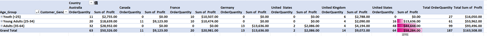
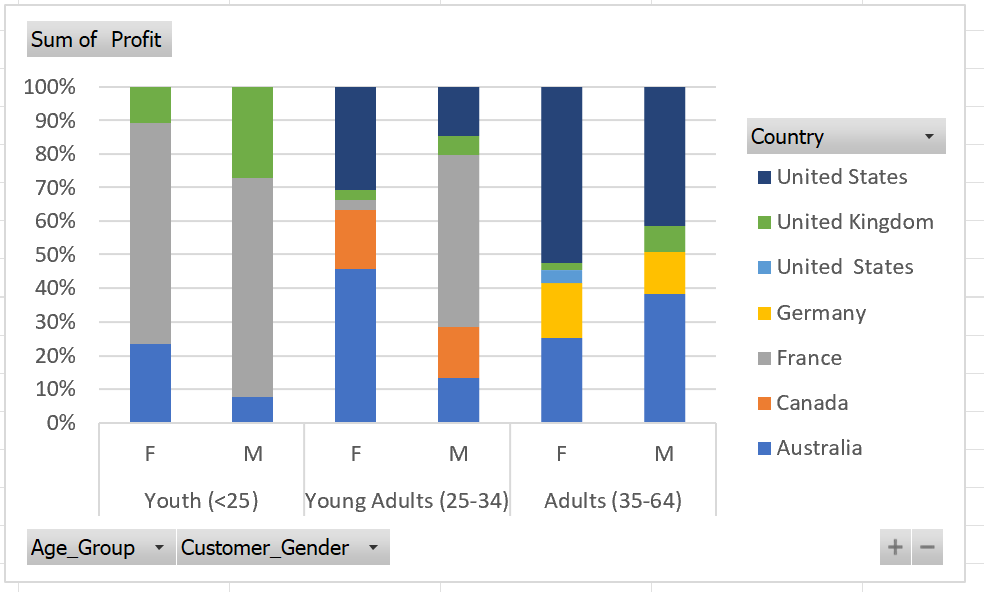
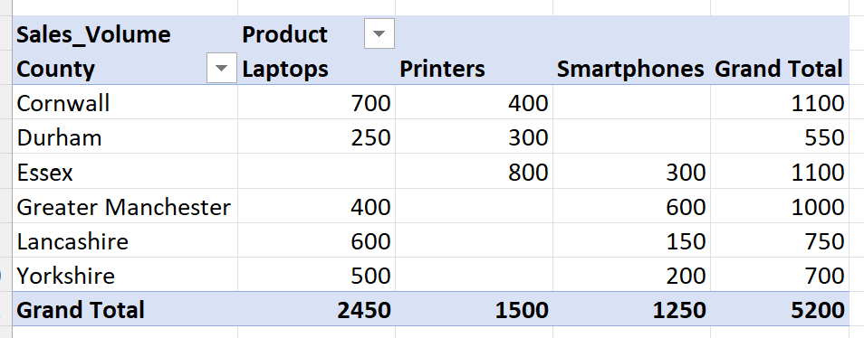
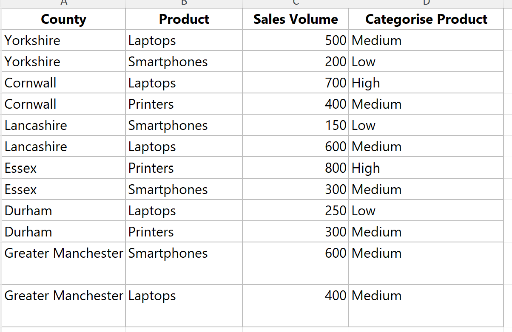

# The World Databases
## Introduction
The project demostrates the ability to use pivot table function to process and visual dataset. The first dataset contains sales transaction in different region with different age group. The second dataset contains the sales performance of different products in various counties in England. The third task used ready pivot table to create visualizations.

TThe objective of this project is to demonstrate key pivot table functions and visualizations for effective data summarization and analysis.

## Tool Used
Microsoft Excel (Pivot table and Visualization)

## Skills Demonstrated
### Task 1 Using Pivot tables to summarise, analyse, explore,present data and charts add visualisations to the data. 

1. Create pivot table by resizing the column widths and centre the data focus on region, Age Group, Customer Gender, Sub-Category and Product columns. Presenting the visualization that sales summary with different age group and gender in different countries.

2. Demonstrate which markets does Germany have customers.

The chart demonstrates that Germany attracts customers in the Adults (35–64) demographic group.

3. Demonstrate what country has sales in all markets.

The chart demonstrates that Australia has sales in all markets.

4. Demostrate what are the most profitable markets by country, age group and gender.

The chart demonstrates that United States are the most profitable markets by country, age group and gender.

5. Demostrate which country are no Adults(35-64) profit.

The chart demonstrates that France are no Adults(35-64) profit.

### Task 2 Create a Pivot Table and Use the Switch function.

1. Insert a Pivot Table to summarise the data by County in the rows and Products in the columns. Use Sales Volume as the value to be summarised.

A completed Pivot Table summarising sales by county and product.

2. In a new column next to data, use the SWITCH function to categorise products based on Sales Volume.

A new column in the dataset categorising products by sales volume using the SWITCH function.

### Task 3 Creating a Line, Column and Pie Chart

1. Creating a Line Chart. This chart will display the Profit and Revenue for the years 2017, 2018, 2019, 2020 and 2021.

